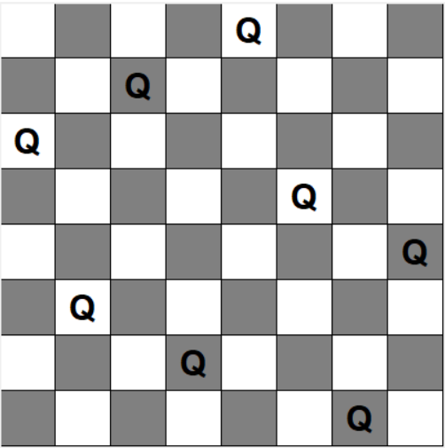

### Description:

The 8 Queens problem is a classic chess puzzle where the task is to place eight queens on an 8×8 chessboard in a way that no two queens threaten each other. This means that no two queens can share the same row, column, or diagonal. It's a challenging problem in computer science and has been the subject of various algorithms and solutions.

### Algorithm Explanation:

The solution provided here utilizes the Hill Climbing algorithm to solve the 8 Queens problem. Here's how it works:

1. **Initialization**:
   - The algorithm starts by randomly placing eight queens on the chessboard. Each queen is represented by a position (row, column) on the board.

2. **Evaluation**:
   - Once the queens are placed, the algorithm evaluates the current state to determine its quality. This evaluation is done using a heuristic function that calculates the number of conflicts between queens. A conflict occurs when two queens threaten each other.

3. **Improvement**:
   - The algorithm iteratively tries to improve the current state by making small changes. It selects a queen with the highest potential for improvement and moves it to a new position that minimizes conflicts.
   - This process continues until either the optimal solution is found (no conflicts between queens) or the algorithm reaches a local optimum where no further improvement is possible.

4. **Random Restart**:
   - If the algorithm gets stuck at a local optimum (i.e., no better move can be made), it performs a random restart. This involves resetting the board to a new random state and starting the hill climbing process again. Random restarts help the algorithm to escape local optima and explore different regions of the search space.

5. **Termination**:
   - The algorithm terminates when it either finds a solution with no conflicts between queens or reaches a predefined stopping condition (e.g., maximum number of iterations or time limit).

6. **Visualization**:
   - The final solution is visually represented using Tkinter, a Python GUI library. The graphical representation shows the positions of the queens on the chessboard.

Overall, the Hill Climbing algorithm provides a simple yet effective approach to solving the 8 Queens problem by iteratively improving the placement of queens based on a heuristic evaluation of the current state. Random restarts further enhance the algorithm's ability to explore the search space and find better solutions.

